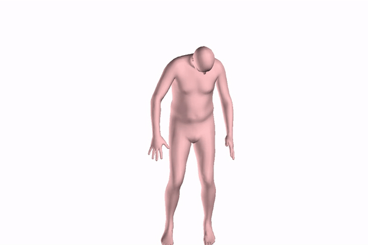
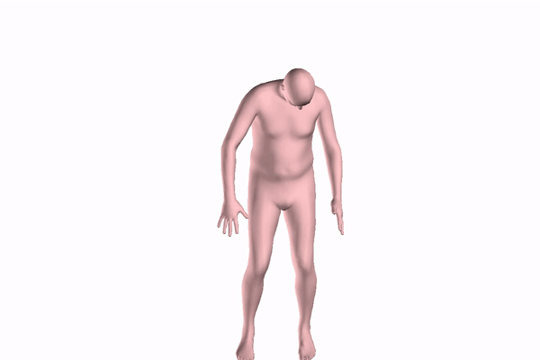
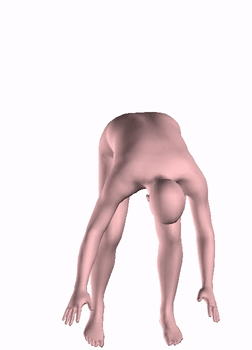

# 3D human pose estimation

## Videos
For the video you have the gif version and the mpg version: 
-If we apply a continuity constraint with small weight 

 
-If we don't apply a continuity constraint with small weight
 

 
-If we don't change the weights 
 

 
We can see that the most important point is the weights. Then the adequate initialization will give this results and we
don't need temporality constraint on the energy(see http://files.is.tue.mpg.de/black/papers/BogoECCV2016.pdf)

## Code

here you can find some scripts or notebook that has been modified for the extension to videos. The code are not executable
A lot of things are missing(library caffe, smpl library...).

Mainly the code comes from :
-https://github.com/ZheC/Realtime_Multi-Person_Pose_Estimation
-http://smplify.is.tue.mpg.de/

So each modified files have a different licenses and these files follow the license of the original file.
This modification has been done for a project.

You can also find the videos done using this dataset :
-https://www.dropbox.com/s/5608fx0p23jdvjp/manipulation_videos.zip?dl=0
